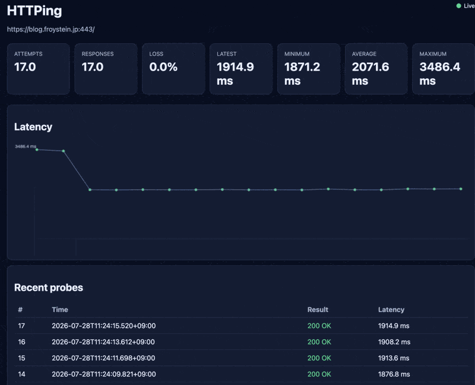

# HTTPing

HTTPing probes an HTTP or HTTPS endpoint and reports response latency.



## Installation

Download an archive or run an installer from the
[latest GitHub Release](https://github.com/stianfro/httping/releases/latest).

On macOS or Linux:

```sh
curl --proto '=https' --tlsv1.2 -LsSf \
  https://github.com/stianfro/httping/releases/download/v0.2.0/httping-installer.sh | sh
```

On Windows PowerShell:

```powershell
powershell -ExecutionPolicy Bypass -c "irm https://github.com/stianfro/httping/releases/download/v0.2.0/httping-installer.ps1 | iex"
```

### Add HTTPing to PATH

The installer puts `httping` in `$CARGO_HOME/bin`, or in
`$HOME/.cargo/bin` when `CARGO_HOME` is not set. It tries to update the
shell startup files automatically. Restart the shell after installation.

If `httping --version` still reports that the command is not found, run the
command for your shell once to add the default install directory permanently.

For Bash:

```bash
printf '\nexport PATH="$HOME/.cargo/bin:$PATH"\n' >> "$HOME/.bashrc"
source "$HOME/.bashrc"
```

For Zsh:

```zsh
printf '\nexport PATH="$HOME/.cargo/bin:$PATH"\n' >> "$HOME/.zshrc"
source "$HOME/.zshrc"
```

For Fish:

```fish
fish_add_path --universal "$HOME/.cargo/bin"
```

If `CARGO_HOME` points to another directory, use `$CARGO_HOME/bin` instead.
The PowerShell installer updates the user PATH. Open a new PowerShell window
after it finishes.

## Usage

```console
❯ httping --help
Ping an HTTP endpoint and report response latency

Usage: httping [OPTIONS] <URL>
       httping [OPTIONS] [URL] <COMMAND>

Commands:
  serve  Show live probe statistics in a local web dashboard
  help   Print this message or the help of the given subcommand(s)

Arguments:
  <URL>  HTTP or HTTPS URL to probe

Options:
  -c, --count <COUNT>        Number of probes to send. By default, probes continue until Ctrl-C
  -i, --interval <DURATION>  Minimum time between probe starts [default: 1s]
  -t, --timeout <DURATION>   Maximum time for DNS setup and for each probe [default: 10s]
      --otlp                 Export OpenTelemetry metrics over OTLP HTTP/protobuf
      --target-name <NAME>   Stable target name for exported metrics
  -h, --help                 Print help
  -V, --version              Print version
```

Durations accept values such as `250ms`, `1s`, and `2m`.

### Local dashboard

Start the local dashboard for a target:

```console
$ httping serve https://example.com
HTTPing https://example.com/
resolved: 93.184.216.34:443
dashboard: http://127.0.0.1:52143/
```

HTTPing selects a free local port and opens the dashboard in the default
browser. The dashboard shows live summary cards, a latency chart, and recent
probe results. It binds only to `127.0.0.1`.

Use `--no-open` to keep the browser closed, `--port` to select a fixed port,
and `--history` to set the number of recent results kept in memory:

```sh
httping serve --no-open --port 8080 --history 500 https://example.com
```

The server stays in the foreground until Ctrl-C. Run it through a shell job,
systemd, or a container when it must continue in the background.

### OpenTelemetry metrics

Metric export is off by default. Enable OTLP HTTP/protobuf export with `--otlp`:

```sh
OTEL_EXPORTER_OTLP_ENDPOINT=http://localhost:4318 \
  httping --otlp --target-name public-api https://example.com/health
```

You can also enable it with `OTEL_METRICS_EXPORTER=otlp`. Setting only an
endpoint does not enable export. Standard OTLP variables configure the metrics
endpoint, headers, timeout, compression, export interval, temporality, service
name, and resource attributes. HTTPing rejects gRPC and HTTP/JSON protocols.

HTTPing exports the standard `http.client.request.duration` histogram and the
`httping.probe.attempts`, `httping.probe.responses`, and
`httping.probe.transport_errors` counters. The default target name contains the
scheme, host, effective port, and path. It never contains URL user information
or query values.

Dashboard and metric export can run together:

```sh
httping serve --otlp --no-open https://example.com/health
```

A Kubernetes container can enable export without changing its arguments:

```yaml
args: ["--interval", "10s", "https://example.com/health"]
env:
  - name: OTEL_METRICS_EXPORTER
    value: otlp
  - name: OTEL_EXPORTER_OTLP_ENDPOINT
    value: http://otel-collector:4318
  - name: OTEL_SERVICE_NAME
    value: httping-public-api
```

Background export errors are written to stderr and do not stop probing. A
finite run exits with status 1 when its final metric flush fails. Ctrl-C still
prints the probe summary and exits with status 0.

```console
$ httping --count 2 https://example.com
HTTPing https://example.com/
resolved: 93.184.216.34:443
2026-07-28T12:00:00.000Z 200 OK 124ms
2026-07-28T12:00:01.000Z 200 OK 42ms

--- httping statistics ---
attempts: 2, responses: 2, loss: 0.0%
time: min 42ms, avg 83ms, max 124ms
```

HTTPing starts the first probe immediately. It continues after request errors.
A finite run exits with status 1 if any probe fails. Pressing Ctrl-C prints the
summary and exits with status 0.
